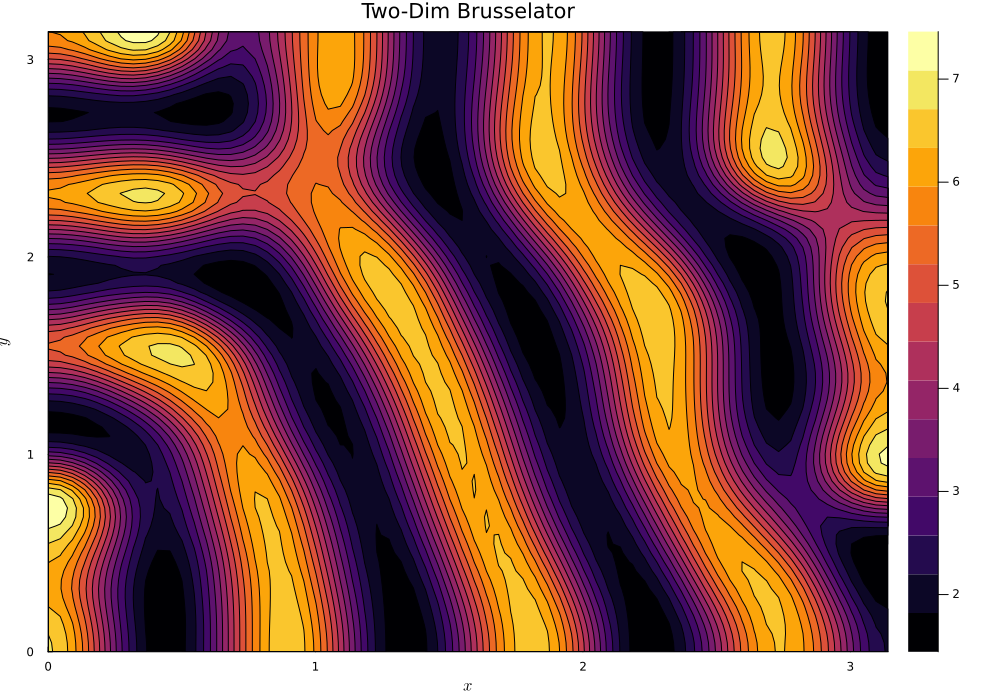
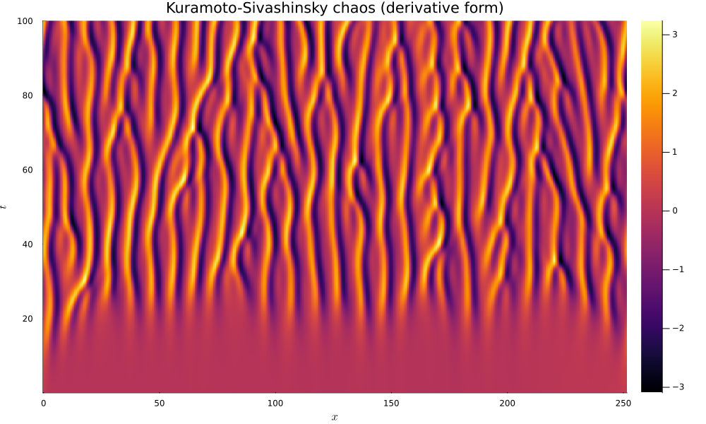
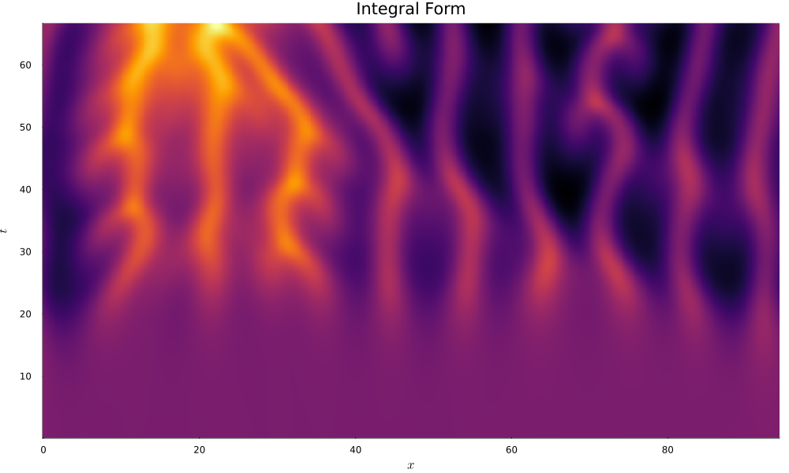

# Properties of the Kuramoto-Sivashinsky equation
This project explores the Kuramoto-Sivashinsky equation, one of the simplest PDEs that exhibits spatiotemporal chaos. All code is written in Julia. Some things found in this repository are:
* **brusselator.ipynb**: an integrator of a 2-dimensional brusselator, a simpler example of pattern formation with nontrivial steady-state solutions.
* **kuramoto_sivashinsky.ipynb**: an integrator for the kuramoto-sivashinsky equation, both in integral and derivative form.
* **writeup.pdf**: (coming soon) a writeup that explores history and properties of the KS equation.

## Results

### Two-Dimensional Brusselator
Here are plots of the brusselator forming stripes

### One-Dimensional Kuramoto-Sivashinsky
Derivative form:

Integral Form:

### Two-Dimensional Kuramoto Sivashinsky
The mean-zero two-dimensional equation has rich behavior and has been the subject of some interesting [numerical work](https://www.researchgate.net/publication/278516973_Nonlinear_dynamics_of_surfactant-laden_multilayer_shear_flows_and_related_systems). Here is a chaotic solution, for K = 5:

And here is a nontrivial steady state for K = 1.5:
